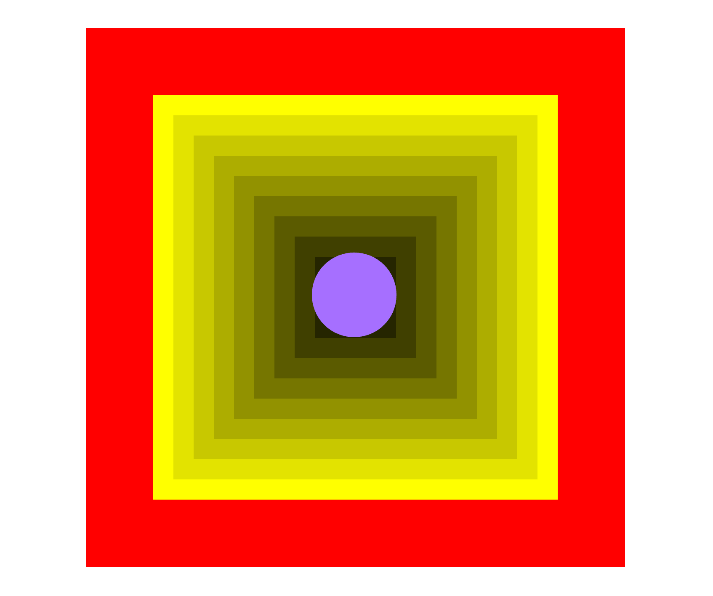
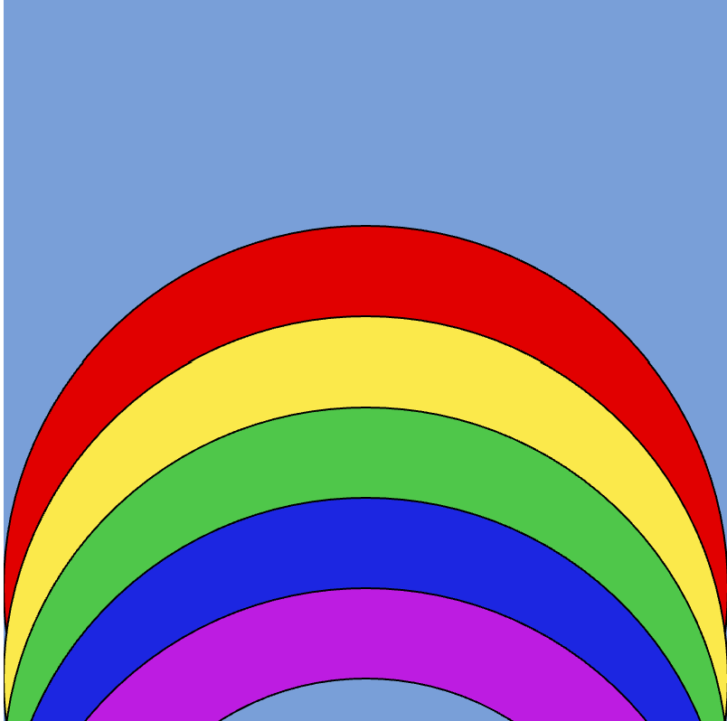
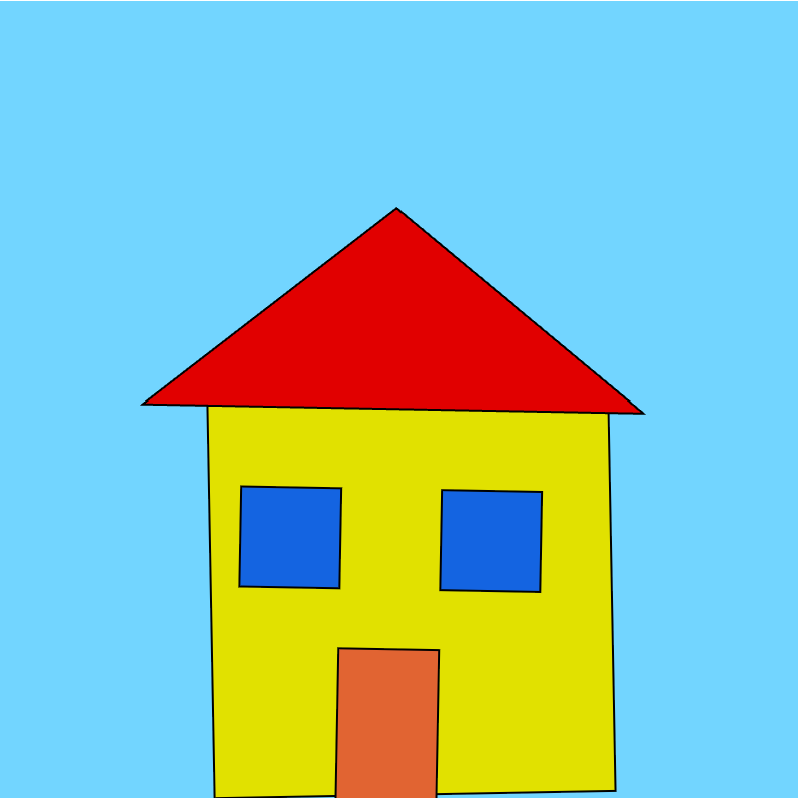
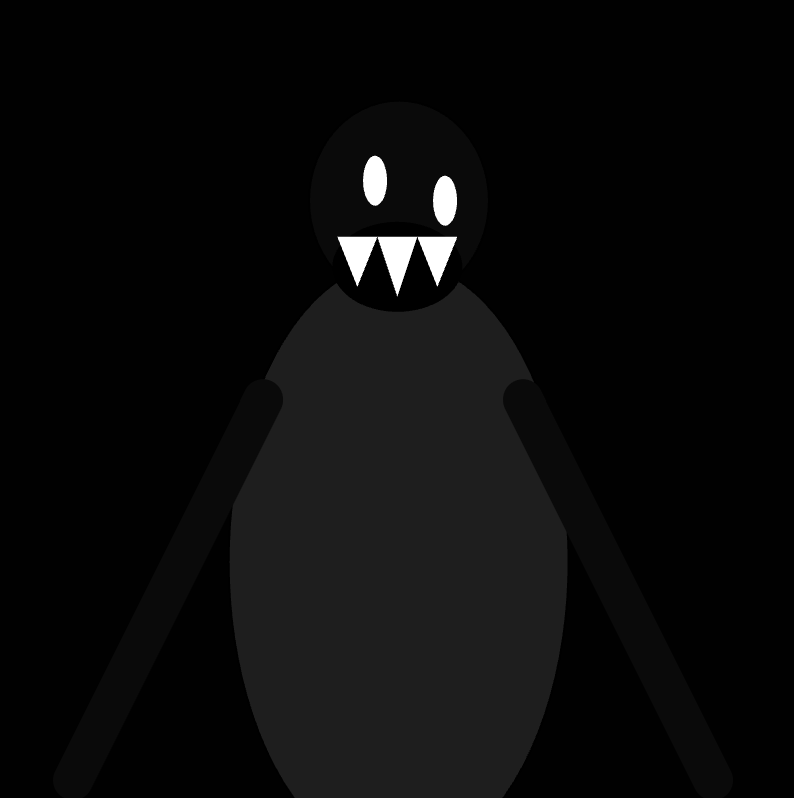

# CART253 Projects

## Sawyer Power

>

## First Project Prototype:

[View this project online](./topics/Prototype-project/index.html)

This project allows you to witnesss a very brightly coloured space.

You control a purple coloured ball with your mouse.

Thats about it!

> 

## PROTOTYPING: INSTRUCTIONS!!!

### Prototype 1: 

[Link to Rainbow Prototype](./Rainbow-Prototype1/index.html)

This prototype is a beautiful rainbow!

> 

### Prototype 2:

[Link to House Prototype](./House-Project/index.html)

This prototype is a house with absolutely NOTHING wrong with it.

> 

### Prototype 3:

[Link To Terrifying Entity Prototype](./Terrifying-Entity/index.html)

This prototype is the scariest thing you will EVER see.

> 

## VARIABLES CHALLENGE:

Completed alongside Nick!

[Link To Mr Furious Challenge](./MrFurious/index.html)

> [Check out my journal!](./journal.md)

 This project uses [p5.js](https://p5js.org).

> This project is licensed under a Creative Commons Attribution ([CC BY 4.0](https://creativecommons.org/licenses/by/4.0/deed.en)) license with the exception of libraries and other components with their own licenses.
