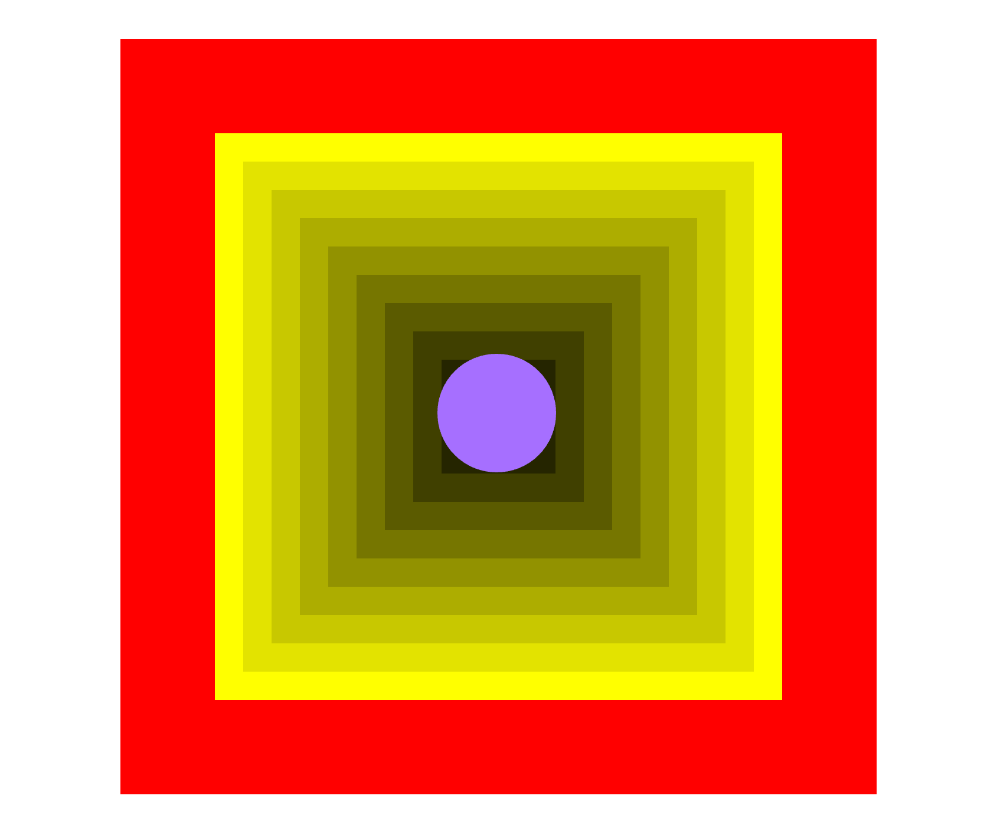
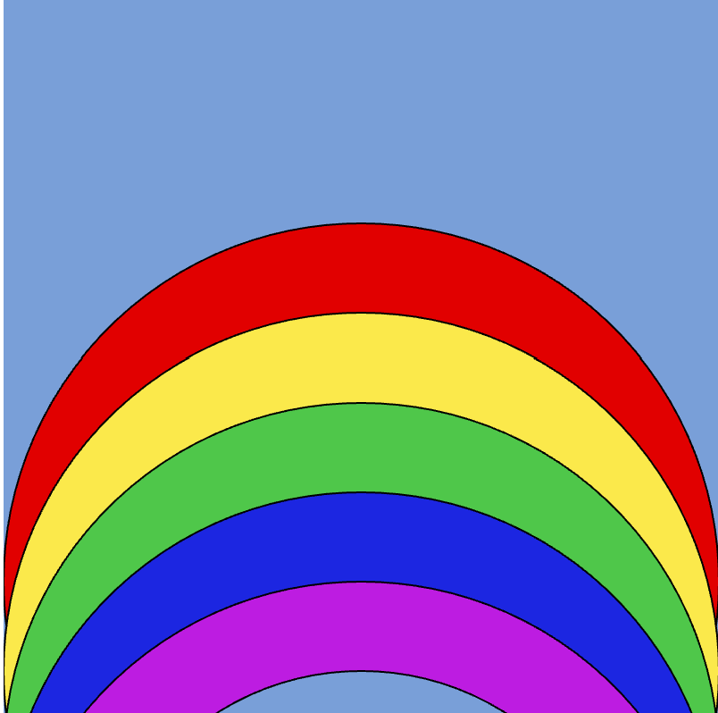
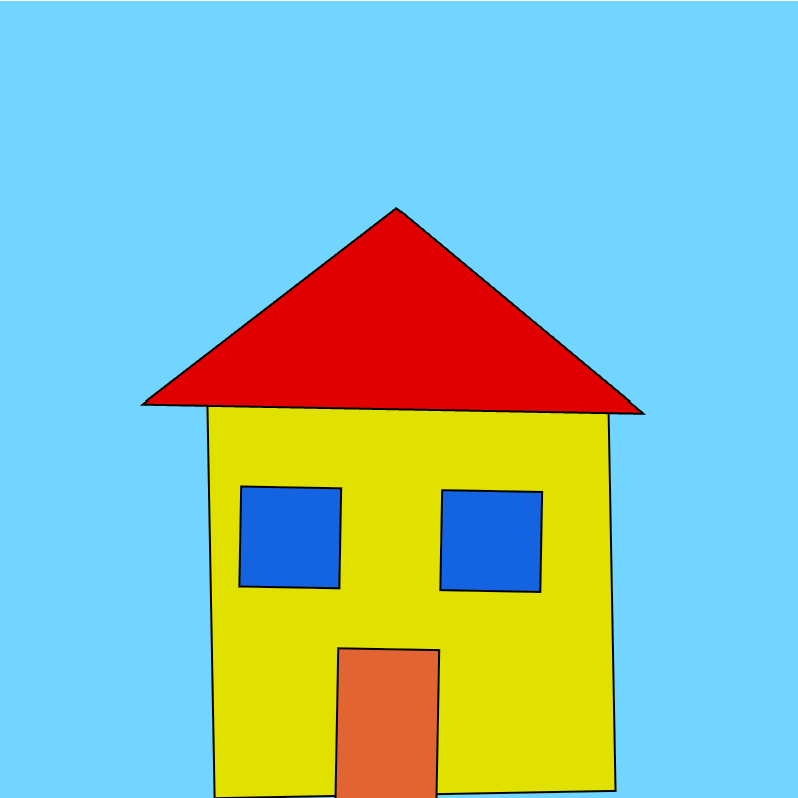
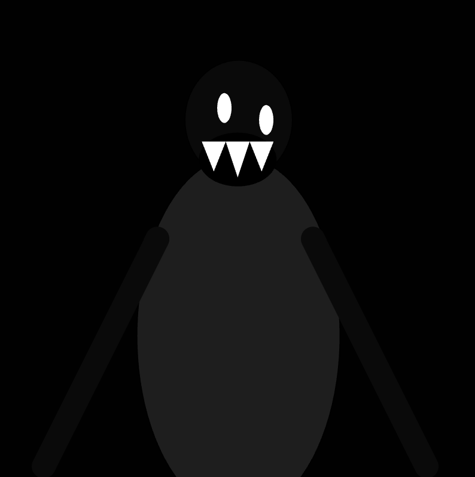
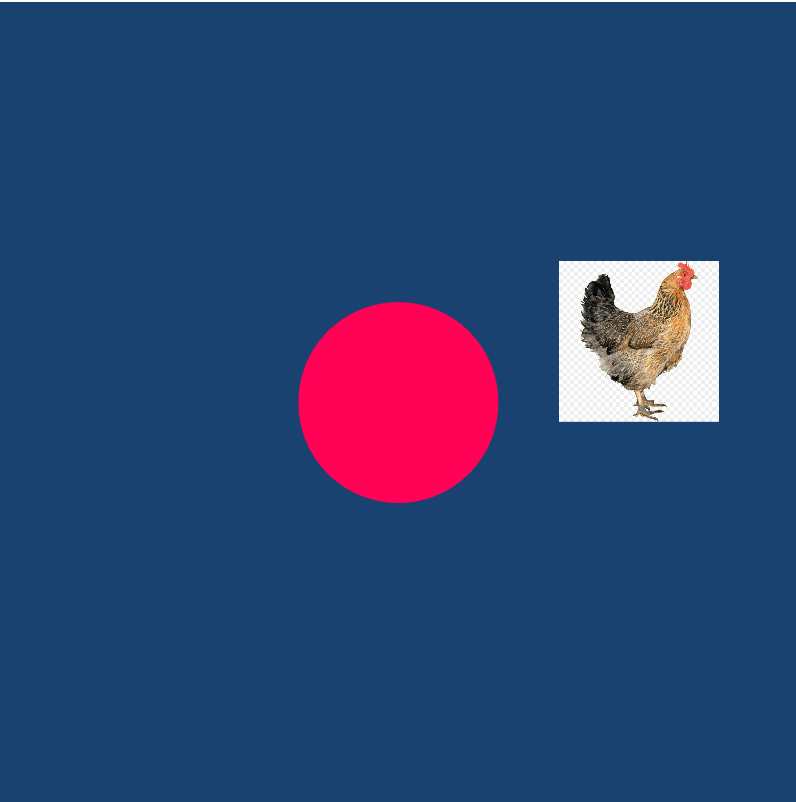
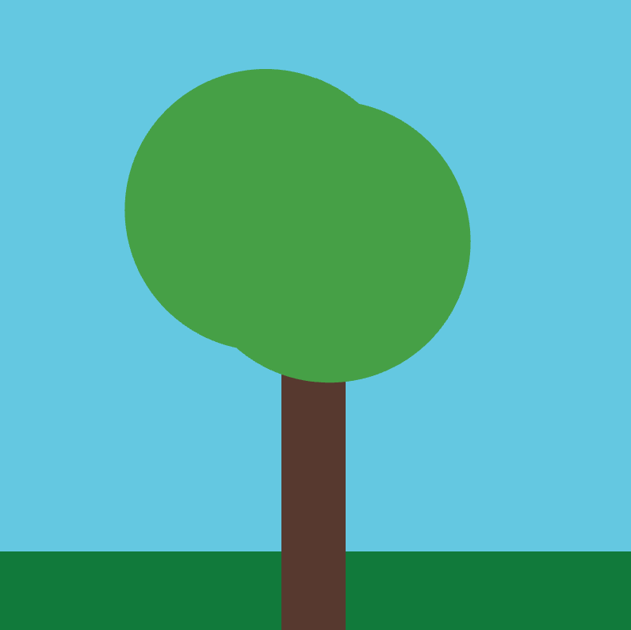
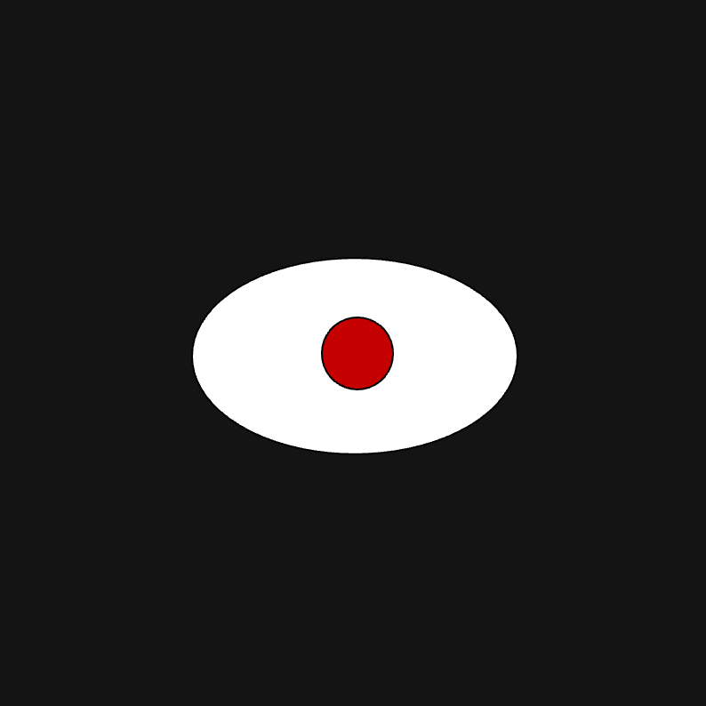
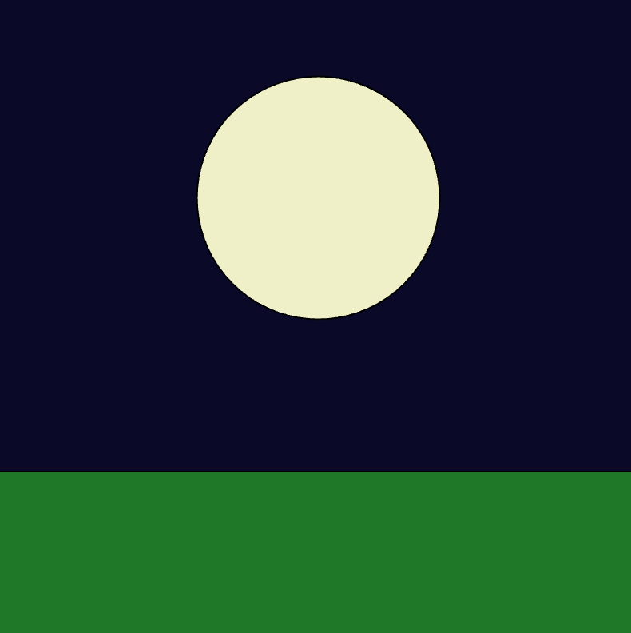

# CART253 Projects

## Sawyer Power

>

## First Project Prototype:

[View this project online](./topics/Prototype-project/index.html)

This project allows you to witnesss a very brightly coloured space.

You control a purple coloured ball with your mouse.

Thats about it!

> 

## PROTOTYPING: INSTRUCTIONS!!!

### Prototype 1: 

[Link to Rainbow Prototype](./Rainbow-Prototype1/index.html)

This prototype is a beautiful rainbow!

> 

[Link to Code](https://github.com/Barcode1100/cart253/blob/main/Rainbow-Prototype1/js/script.js)

### Prototype 2:

[Link to House Prototype](./House-Project/index.html)

This prototype is a house with absolutely NOTHING wrong with it.

> 

[Link to Code](https://github.com/Barcode1100/cart253/blob/main/House-Project/js/script.js)

### Prototype 3:

[Link To Terrifying Entity Prototype](./Terrifying-Entity/index.html)

This prototype is the scariest thing you will EVER see.

> 

[Link to Code](https://github.com/Barcode1100/cart253/blob/main/Terrifying-Entity/js/script.js)

## VARIABLES CHALLENGE:

Completed alongside Nick!

[Link To Mr Furious Challenge](./MrFurious/index.html)

> 

## VARIABLE PROTOTYPES:

### Prototype 1

 [Link to Tree](./A_Tree_Grows/template-p5-project/index.html)

 If you want to watch a digital tree grow? Knock yourself out!

 >

 [Link to Code](https://github.com/Barcode1100/cart253/blob/main/A_Tree_Grows/template-p5-project/js/script.js)

### Prototype 2

 [Link to Creepyeye](./creepyeye_prototype/index.html)

 You can't escape the eye...

 >
 [Link to Code](https://github.com/Barcode1100/cart253/blob/main/creepyeye_prototype/index.html)

### Prototype 3

 [Link to Moon Crash](./moon_crashes/index.html)

 Based off of Majora's Mask, the moon crashes down!

 >

 [Link to Code](https://github.com/Barcode1100/cart253/blob/main/moon_crashes/index.html)

# > [Check out my journal!](./journal.md)

 These projects use [p5.js](https://p5js.org).

 

> This project is licensed under a Creative Commons Attribution ([CC BY 4.0](https://creativecommons.org/licenses/by/4.0/deed.en)) license with the exception of libraries and other components with their own licenses.
